# **POLICE**: **P**rovably **O**ptimal **LI**near **C**onstraint **E**nforcement for Deep Neural Networks [[Arxiv](https://arxiv.org/abs/2211.01340), [Twitter](https://twitter.com/randall_balestr/status/1587973035335843840?s=20&t=gFV-VdN_LVAdPrcngWvO3Q)]

*This repository allows to reproduce all the figures and tables of our arxiv pre-print.*

## POLICE in a nutshell
How can you train a DNN so that it minimizes some given loss $\mathcal{L}$ on some given training dataset $\mathcal{S}$  while *provably enforcing some constraints on its mapping* e.g. that the DNN is affine on some region $R$ as in
$$
\min_{\theta} \mathcal{L}(f_{\theta},\mathcal{S}) \;\; ?\overset{?}{\underset{?}{\textbf{and}}}? \;\;f_{\theta}(x) \text{ is affine on $R$},
$$
of course one could employ regularization to enforce the constraint, but this suffers from the curse of dimensionality and does not provide any guarantee unless the regularization is tested on *infinite samples*.

Instead, we propose **POLICE** which is a simple method that provably enforces constraints like above on any DNN that employes activations within the (leaky)-ReLU, absolute value, max-pooling family, and any linear mapping in-between e.g. fully-connected or convolution. 
For **POLICE** to work, you will need:

- a DNN with nonlinearities such as (leaky)-ReLU, absolute value, max-pooling 
- a convex region ($R$ above) where the DNN needs to be constrained to stay affine
- the vertices that define that region ($R$ above)

given those vertices, POLICE simply consists in adding them to your original mini-batch at each forward pass, and using the method presribed by `enforce_constraint_forward` defined in [utils.py](./utils.py)

## Classification settings (Fig. 1, [figure_1.py](./figure_1.py))

If we constrain the DNN to be affine on a specific region of its domain, it directly means that the decision boundary obtained by composing this constrained DNN with a linear classifier will also be linear within that region! Here is an illustration that is generated with the provided scripte, trying to solve a binary classification task of orange points versus purple with constrained region highlighted with the black dots and square:

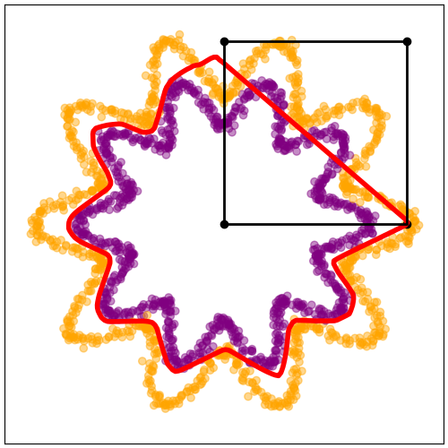

## Regression settings (Fig. 2 and 3, [figure_2.py](./figure_2.py) and [figure_3.py](./figure_3.py))

Obviously the same goes if solving a regression task. We highlight here a simple example that consists of training a DNN solve a $\mathbb{R}^2 \mapsto \mathbb{R}$ regression problem where we use POLICE to impose the affine constraints on some part of the DNN's domain corresponding to Fig. 2:

| Triangle region                                             | Polygon region                                             | (near) circle region                                      |
| ----------------------------------------------------------- | ---------------------------------------------------------- | --------------------------------------------------------- |
| 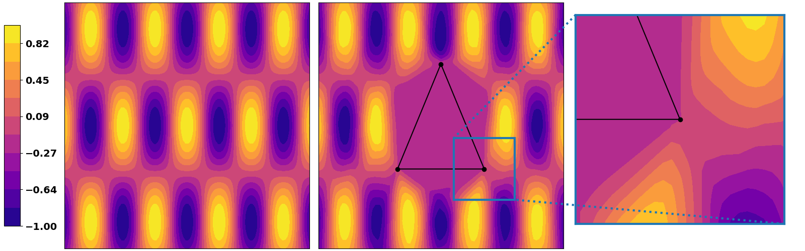   | 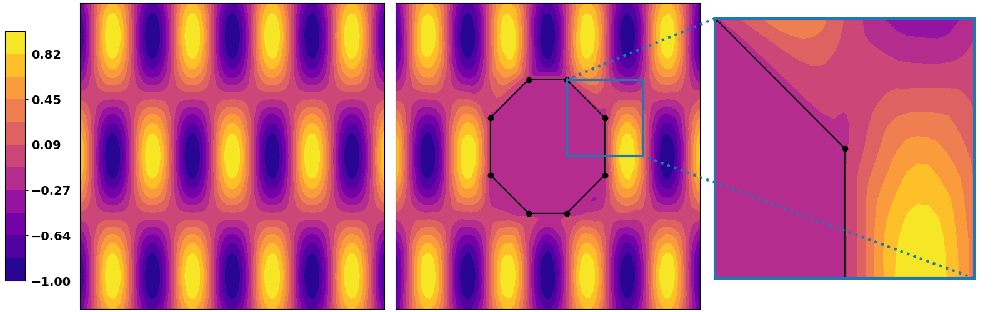   | 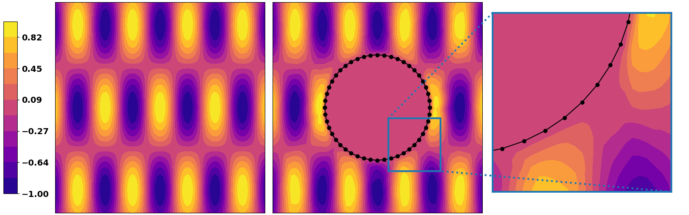   |
| 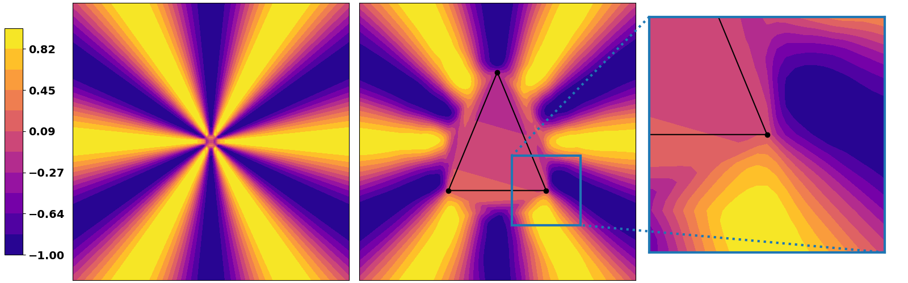   | 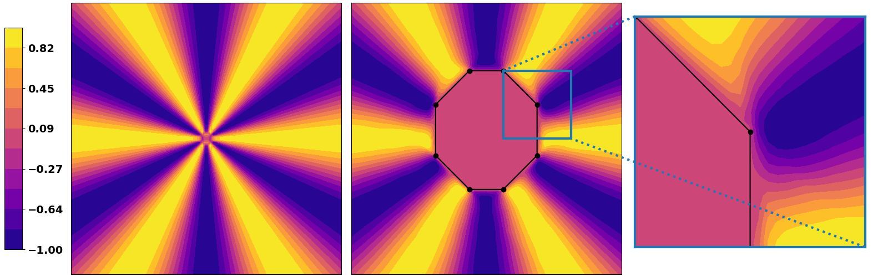   | 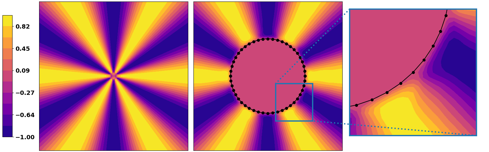   |
| 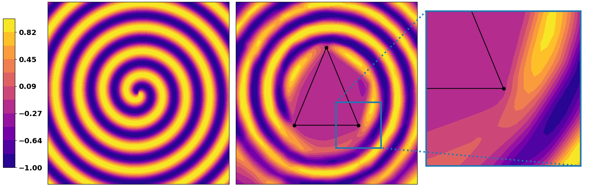 | 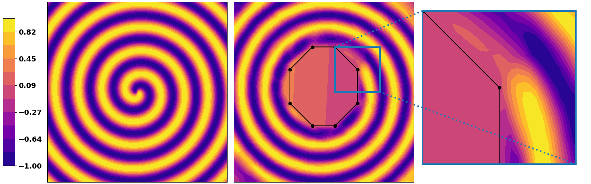 | 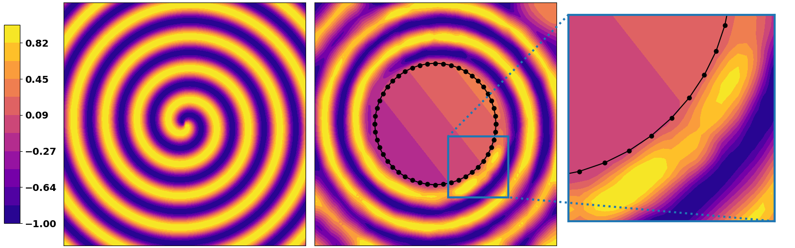 |

And we can also visualize the evolution during training that corresponds to Fig. 3:
 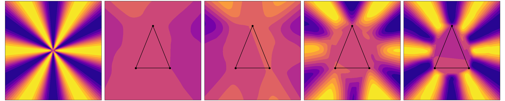 

